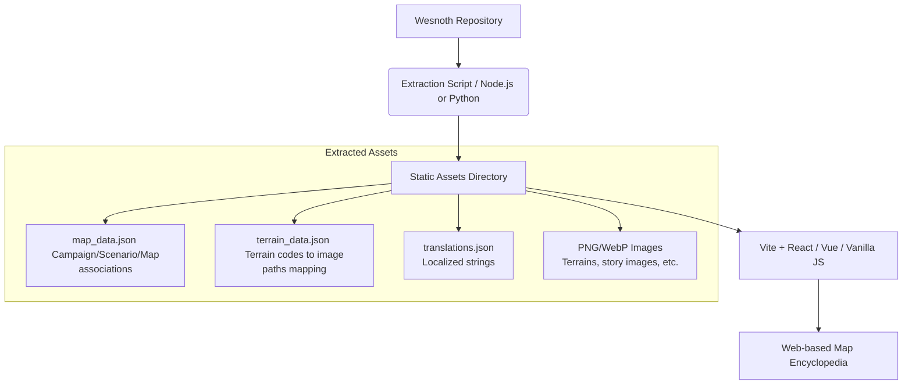

# Wesnoth Map Encyclopedia (Map Viewer) Research & Implementation Guide

This document summarizes the research on the Battle for Wesnoth codebase and assets to build a web-based Map Encyclopedia / Viewer. It covers the data structures, map parsing rules, coordinate math for rendering, and the recommended architecture.

## 1. Overall Architecture

To ensure smooth performance in the browser, we recommend a **pre-compilation (build-time) approach** where game configurations and map files are parsed beforehand into JSON and static image files, rather than doing heavy WML parsing dynamically on the client side.



---

## 2. Key Data Files & Parsing Specifications

### A. Map Grids (`.map`)
Located in `data/campaigns/<campaign_name>/maps/` or `data/multiplayer/maps/`.

*   **Structure**: Comma-separated grid format.
    Example: `Gs^Fms, Gs^Fms, Gll^Fp, Gll^Fp, Ww, Hh, 2 Khr, Chr`
*   **Parsing Logic** (based on `read_game_map` in `src/terrain/translation.cpp`):
    1. Split the file content by newline to get rows (Y-axis), then split each line by comma `,` to get cells (X-axis).
    2. **Starting Positions**: If a cell contains a space (e.g., `2 Khr`), split by space:
        *   The first part (`2`) is the player's starting position number.
        *   The second part (`Khr`) is the terrain code.
    3. **Base & Overlay Terrains**: If a terrain code contains a caret `^` (e.g., `Gs^Fms`):
        *   Left of `^` (`Gs`) is the **base terrain** (Savanna).
        *   Right of `^` (`Fms`) is the **overlay terrain** (Pine Forest).
        *   If no `^` is present, it is just a base terrain.

### B. Terrain Definitions (`data/core/terrain.cfg`)
Maps terrain codes to their human-readable names and image assets.

*   **WML Tag Example**:
    ```wml
    [terrain_type]
        symbol_image=water/coast-tile
        id=medium_shallow_water
        name= _ "Shallow Water"
        editor_name= _ "Medium Shallow Water"
        string=Ww
        editor_group=water
    [/terrain_type]
    ```
*   **Important Keys**:
    *   `string`: The terrain code (e.g., `Ww`. Overlays start with `^`, e.g., `^Wkf`).
    *   `name`: Translatable string ID (e.g., `Shallow Water`).
    *   `symbol_image`: Path to the terrain icon (relative to `data/core/images/terrain/`, with no `.png` extension).
    *   `default_base`: For overlays, the fallback base terrain to render on if no base is specified (e.g., `Ww` for `sea_kelp`).

### C. Campaign and Scenario Metadata
Associates campaigns and scenarios with their corresponding map grids.

*   **Campaign Definition (`data/campaigns/<Campaign>/_main.cfg`)**:
    *   Find the `[campaign]` tag and extract `name` (Campaign Title), `icon`, and `first_scenario`.
*   **Scenario Definition (`data/campaigns/<Campaign>/scenarios/*.cfg`)**:
    *   Find the `[scenario]` tag and extract `id` (Scenario ID), `name` (Scenario Title), and `map_file` (corresponding `.map` filename).
    *   **Map Items & Labels**: Some scenarios define overlay items or text labels on the map:
        *   `[item] x=40 y=28 image=items/archery-target-right.png [/item]` (overlays an image at coordinates)
        *   `[label] x=4 y=36 text=_"Essarn" [/label]` (renders text at coordinates)

### D. Translations (`po/wesnoth-lib/ja.po` etc.)
Wesnoth uses gettext for localization.
*   You can parse localization files (e.g., `.po` files) to extract translation mappings for terrain names (e.g., `Shallow Water` -> `Eau peu profonde`).
*   Pre-compile these `.po` files to a JSON dictionary (e.g., `{"Shallow Water": "Eau peu profonde"}`) to use in the browser.

---

## 3. Map Geometry & Coordinate System

### A. Hex Orientation and Size
*   Wesnoth uses a **flat-topped** hex grid.
*   The bounding box of each hex tile is **`72 x 72` pixels**.

### B. Coordinate Math (Odd-Q Column-Staggered System)
Based on `to_cubic` and `from_cubic` in `src/map/location.hpp`, columns are staggered vertically, with odd columns shifted down.

For a cell at column `col` (0-indexed) and row `row` (0-indexed), the pixel coordinates $(X, Y)$ of its top-left corner are:

$$X = col \times 54$$

$$Y = row \times 72 + \begin{cases} 36 & (\text{if } col \text{ is odd}) \\ 0 & (\text{if } col \text{ is even}) \end{cases}$$

> [!NOTE]
> *   The horizontal offset step is $72 \times 0.75 = 54$ pixels, creating an interlocking column layout.
> *   The vertical stagger is $72 \div 2 = 36$ pixels.
> *   The total width of a map rendering is `(cols - 1) * 54 + 72` pixels, and the total height is `rows * 72 + 36` pixels.

### C. Layer Stacking Order
When rendering a tile at coordinate `(col, row)`, stack the images in the following order:
1.  **Base Terrain Image** (`symbol_image`)
2.  **Overlay Terrain Image** (if present)
3.  **Starting Position Badge/Number** (if present)
4.  **Scenario Item** (if defined via `[item]`)
5.  **Scenario Label** (if defined via `[label]`)

---

## 4. Implementation Roadmap

1.  **Data Extraction Scripts**: Create a script (Python or Node.js) to parse `terrain.cfg`, campaigns, maps, and `.po` translation files, outputting a set of unified JSON files and copying/converting image files.
2.  **Map Renderer**: Set up a web app (Vite + React/Vue/Svelte) and build a Zoomable/Draggable 2D Canvas or SVG hex grid renderer using the coordinate math above.
3.  **Encyclopedia UI**: Add lists of campaigns and scenarios, click-to-view map functionality, and a terrain dictionary showing the properties and localization of each tile type.
